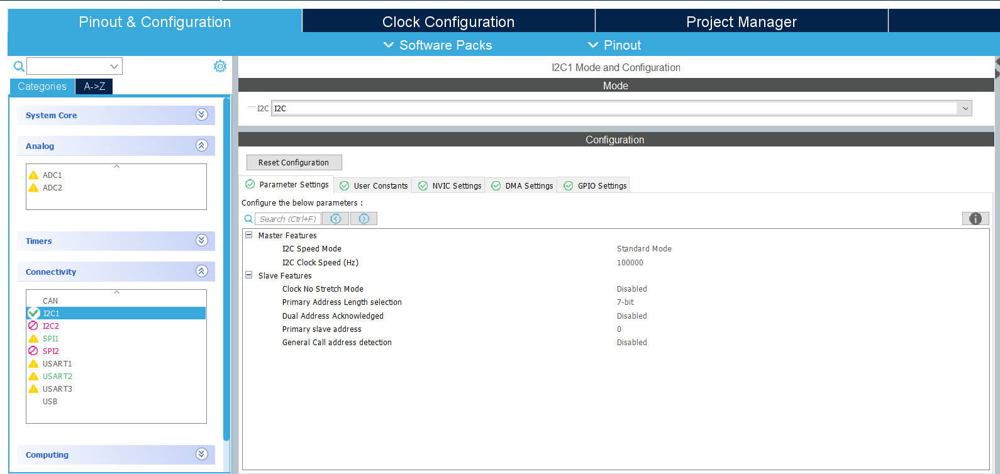
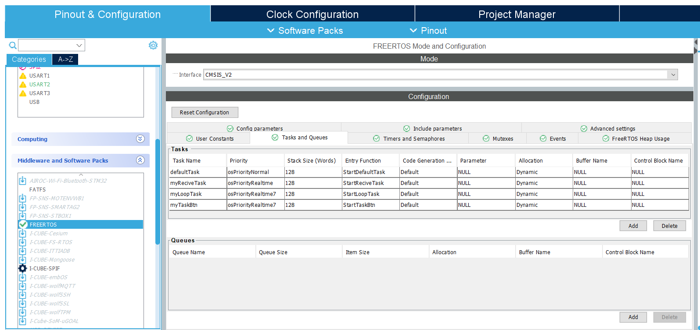
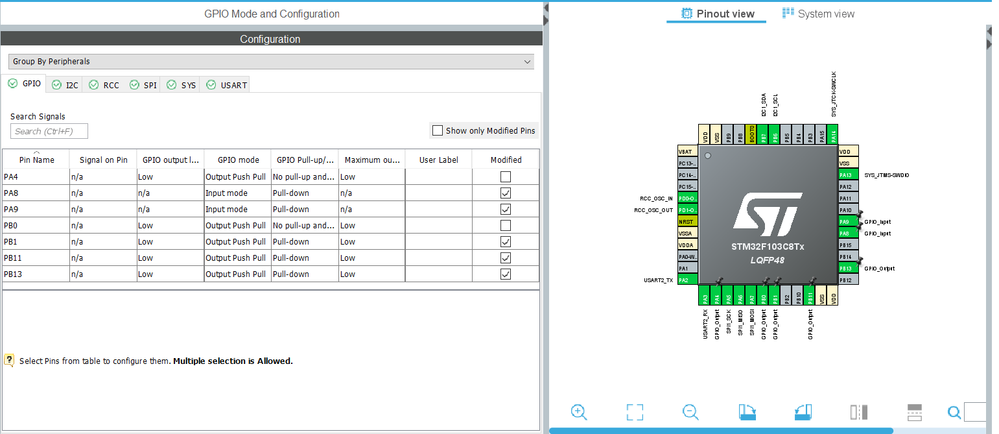
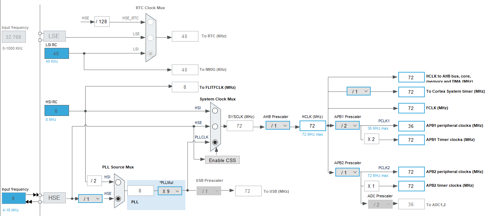
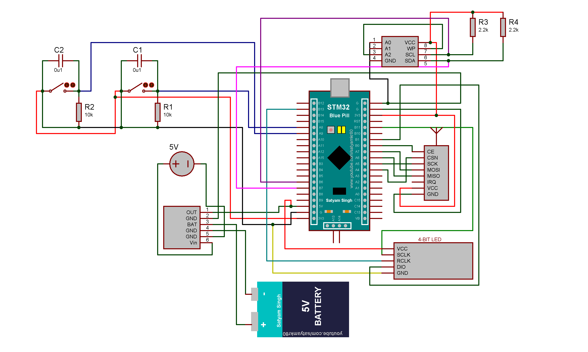
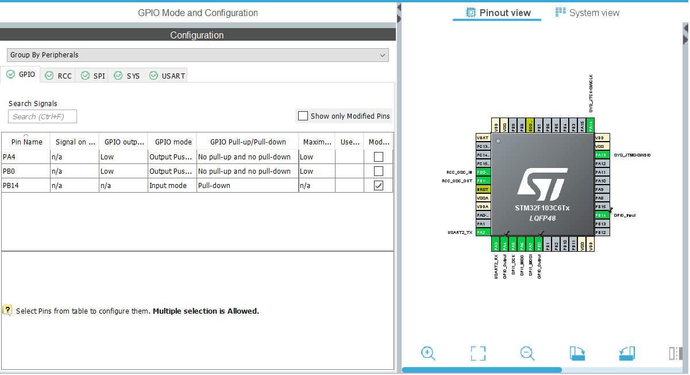
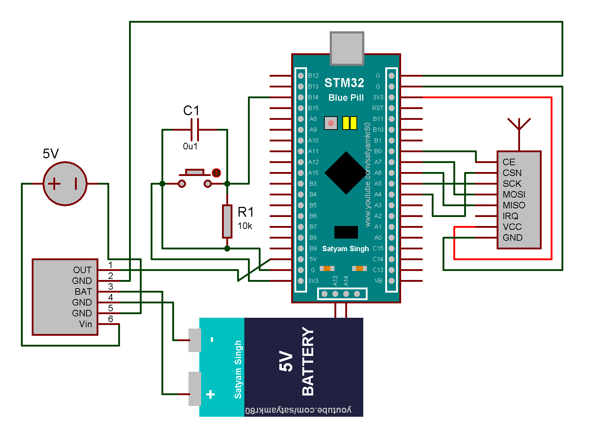

**[English](README.md)** | [Українська](README_UA.md)

# Unit counter project via NRF24 based on STM32

## What you need for work

**Components**

* 2x BluePill

* 2x NRF24l01

* 4-digit 7-segment display with 74HC595 shift register

* 2x Button microswitch SMD 4 pins 6x6x11mm

* Switch SS-5GL

* Monolithic mounting capacitor `0.1uF`

* 3x Resistor `10kOm`

* 2x Resistor `2.2kOm`

* AT24C16N SOIC8 chip

* 2x MH-CD42 charging board

* Power switch without backlight RY106s

* 2x Battery holder for 18650 (2p)

* Breadboard

**Software**

* ST-LINK V2 programmer for STM32

* STM32CubeIDE

**Libraries**

* [NRF24l01](https://github.com/controllerstech/NRF24L01)

* [4-digit 7-segment display with 74HC595 shift register](https://github.com/Korzhak/STM32_7Segment_74HC595_Library)

* [EEPROM for STM32](https://github.com/controllerstech/STM32/tree/034758ed85bfca74d367c31dec64c32939faecf3/EEPROM_STM32)

## Project setup

**RX**

1. Project configuration:
   - `SYS` (Debug->Serial Wire)

   - `RCC` (HSE->Crystal/Ceramic Resonator)

   - `SPI1` (Mode->Full-Duplex Master)

   - `USART2` (Mode->Asynchronous)

   - `I2C` (I2C->I2C)
   

   - `FREERTOS` (Interface->CMSIS_V2)
   

   - `GPIO->`
   

   - `Clock Configuration->`
   

2. Connections:

   - STM32BluePill до NRF24l01: `3.3V - VCC`, `GND - GND`, `PB0 - CE`, `PA7 - MOSI`, `PA6 - MISO`, `PA5 - SCK`, `PA4 - CSN`
   
   - STM32BluePill до LED: `5V - VCC`, `GND - GND`, `PA11 - SCLK`, `PA10 - RCLK`, `PA9 - DIO` 

   - STM32BluePill до AR24C16N: `VCC - 3.3V`, `GND,A0-A2,WP - GND`, `SCL - PB6`, `SDA - PB7`

   - STM32BluePill до BTN+: `BTN - PA8`, `GND with Resisitor - GND`, `VCC - VCC`

   - STM32BluePill до BTN-: `BTN - PA9`, `GND with Resisitor - GND`, `VCC - VCC`

   - STM32BluePill до MH-CD42: `OUT - 5V`, `GND - GND`, `BAT - Batbattery+`, `GND - Batbattery-`, `Power+ - Vin`, `Power- - GND` 

   

3. Go to ***NRF24L01.c*** and replace with your own values if necessary

```cpp
#define NRF24_CE_PORT   GPIOB // Specify your port
#define NRF24_CE_PIN    GPIO_PIN_0 // Specify your pin

#define NRF24_CSN_PORT   GPIOA // Specify your port 
#define NRF24_CSN_PIN    GPIO_PIN_4 // Specify your pin
```

4. Go to ***main.c*** and replace with your own values if necessary

```cpp
/* USER CODE BEGIN 2 */
  NRF24_Init();

  NRF24_RxMode(RxAddress, 10);

  NRF24_ReadAll(data);
 //                 SCLK PIN   SCLK Port   RCLK PIN   RCLK Port   DIO PIN   DIO PORT
  setUp(&ledStruct, GPIO_PIN_11, GPIOB, GPIO_PIN_13, GPIOB, GPIO_PIN_9, GPIOA); // replace with your values 

  /* USER CODE END 2 */
```

5. Go to ***EEPROM.c*** and replace with your own values if necessary

```cpp
// Define the I2C
extern I2C_HandleTypeDef hi2c1;
#define EEPROM_I2C &hi2c1 // Connect your own interface

// EEPROM ADDRESS (8bits)
#define EEPROM_ADDR 0xA0 // Enter your address. Depending on the connection

// Define the Page Size and number of pages
#define PAGE_SIZE 64     // In bytes
#define PAGE_NUM  512    // Number of pages
```

**TX**

1. Project configuration:
   - `SYS` (Debug->Serial Wire)

   - `RCC` (HSE->Crystal/Ceramic Resonator)

   - `SPI1` (Mode->Full-Duplex Master)

   - `USART2` (Mode->Asynchronous)

   - `GPIO->`
   

   - `Clock Configuration->`
   

2. Connections:

   - Connect STM32BluePill to NRF24l01: `3.3V - VCC`, `GND - GND`, `PB0 - CSN`, `PA7 - MOSI`, `PA6 - MISO`, `PA5 - SCK`, `PA4 - CE`
   
   - Connect STM32BluePill to Breadboard and SS-5GL: `3.3V - +`, `GND - -`, `PB1 - Breadboard`

   - STM32BluePill to MH-CD42: `OUT - 5V`, `GND - GND`, `BAT - Batbattery+`, `GND - Batbattery-`, `Power+ - Vin`, `Power- - GND`

   


3. Go to ***NRF24L01.c*** and replace with your own values if necessary

```cpp
#define NRF24_CE_PORT   GPIOB // Specify your port
#define NRF24_CE_PIN    GPIO_PIN_0 // Specify your pin

#define NRF24_CSN_PORT   GPIOA // Specify your port 
#define NRF24_CSN_PIN    GPIO_PIN_4 // Specify your pin
```
