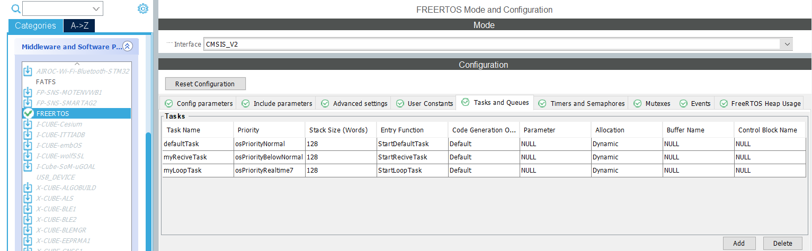
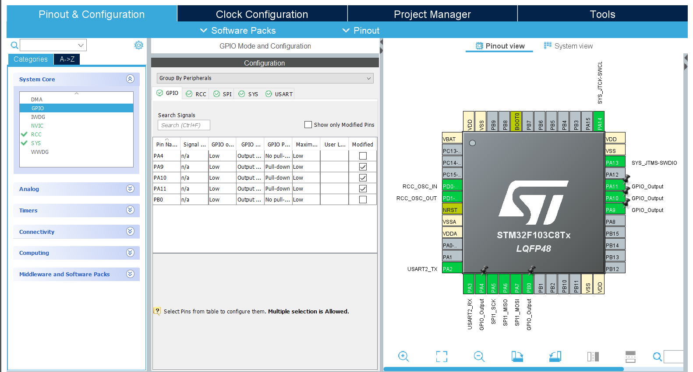
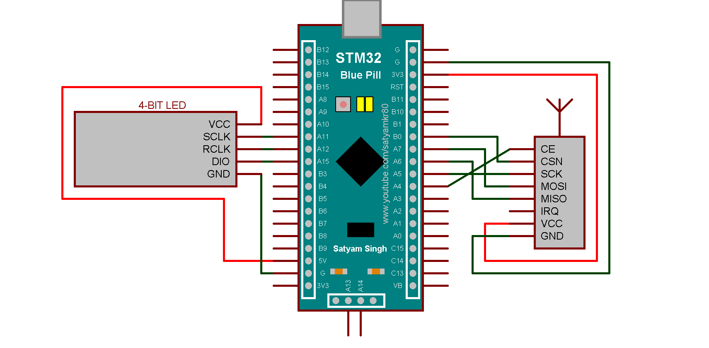
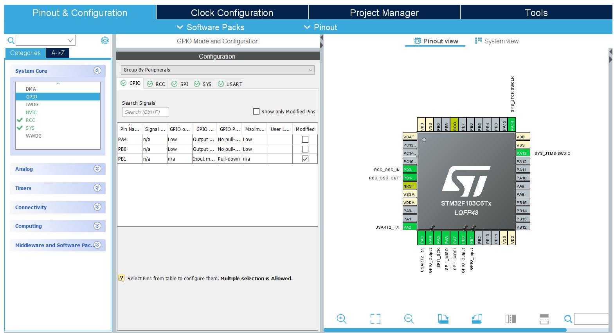

**[English](REAMDE.md)** | [Українська](README_UA.md)

# Unit Counter Project Using NRF24 Transmission Based on STM32

## Required Components

**Hardware**

* 2X BluePill

* 2X NRF24l01

* 4-digit 7-segment display with 74HC595 shift register

* SS-5GL switch

* Monolithic ceramic capacitor `0.1uF`

* Resistor `10kOm`

* Breadboard

**Software**

* ST-LINK V2 programmer for STM32

* STM32CubeIDE

* STM32CubeIDE

**Libraries**

* [NRF24l01](https://github.com/controllerstech/NRF24L01)

* [4-digit 7-segment display with 74HC595 shift register](https://github.com/Korzhak/STM32_7Segment_74HC595_Library)

## Project Setup

**RX (Receiver)**

1. Project Configuration:
   - `SYS` (Debug->Serial Wire)

   - `RCC` (HSE->Crystal/Ceramic Resonator)

   - `SPI1` (Mode->Full-Duplex Master)

   - `USART2` (Mode->Asynchronous)

   - `FREERTOS` (Interface->CMSIS_V2)
   

   - `GPIO->`
   

   - `Clock Configuration->`
   

2. Connections:

   - Connect STM32BluePill to NRF24l01: `3.3V - VCC`, `GND - GND`, `PB0 - CSN`, `PA7 - MOSI`, `PA6 - MISO`, `PA5 - SCK`, `PA4 - CE`
   
   - Connect  STM32BluePill to LED: `5V - VCC`, `GND - GND`, `PA11 - SCLK`, `PA10 - RCLK`, `PA9 - DIO`  

   

3. Modify  ***NRF24L01.c*** with your specific values if needed:

```cpp
#define NRF24_CE_PORT   GPIOA // Set your port
#define NRF24_CE_PIN    GPIO_PIN_4 // Set your pin

#define NRF24_CSN_PORT   GPIOB // Set your port
#define NRF24_CSN_PIN    GPIO_PIN_0 // Set your pin
```

4. Modify ***main.c*** with your specific values if needed:

```cpp
/* USER CODE BEGIN 2 */
  NRF24_Init();

  NRF24_RxMode(RxAddress, 10);

  NRF24_ReadAll(data);
 //                 SCLK PIN   SCLK Port   RCLK PIN   RCLK Port   DIO PIN   DIO PORT
  setUp(&ledStruct, GPIO_PIN_11, GPIOA, GPIO_PIN_10, GPIOA, GPIO_PIN_9, GPIOA); //  Replace with your values

  /* USER CODE END 2 */
```

**TX (Transmitter)**

1. Project Configuration:
   - `SYS` (Debug->Serial Wire)

   - `RCC` (HSE->Crystal/Ceramic Resonator)

   - `SPI1` (Mode->Full-Duplex Master)

   - `USART2` (Mode->Asynchronous)

   - `GPIO->`
   

   - `Clock Configuration->`
   

2. Connections:

   - Connect STM32BluePill to NRF24l01: `3.3V - VCC`, `GND - GND`, `PB0 - CSN`, `PA7 - MOSI`, `PA6 - MISO`, `PA5 - SCK`, `PA4 - CE`
   
   - Connect STM32BluePill to Breadboard and SS-5GL: `3.3V - +`, `GND - -`, `PB1 - Breadboard` 

   

3. Modify ***main.c*** with your specific values if needed:

```cpp
#define NRF24_CE_PORT   GPIOA // Set your port
#define NRF24_CE_PIN    GPIO_PIN_4 // Set your pin

#define NRF24_CSN_PORT   GPIOB // Set your port
#define NRF24_CSN_PIN    GPIO_PIN_0 // Set your pin
```
