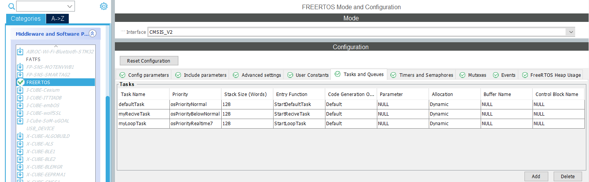
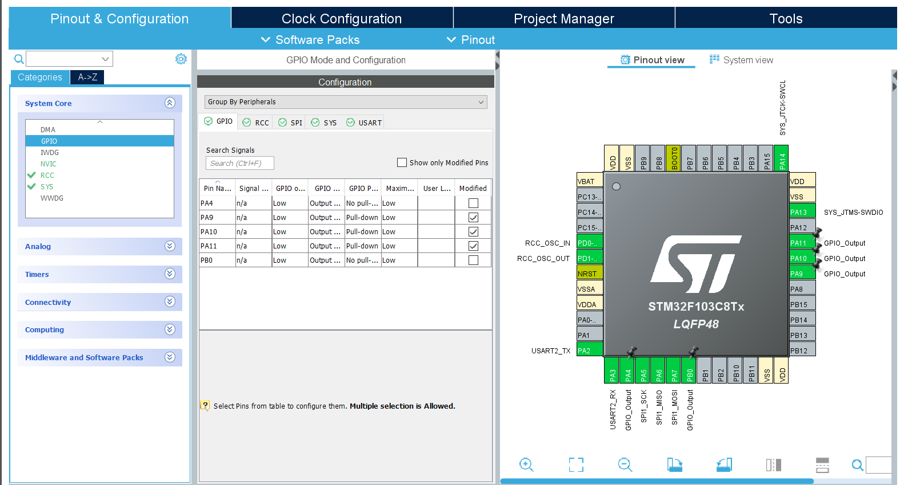
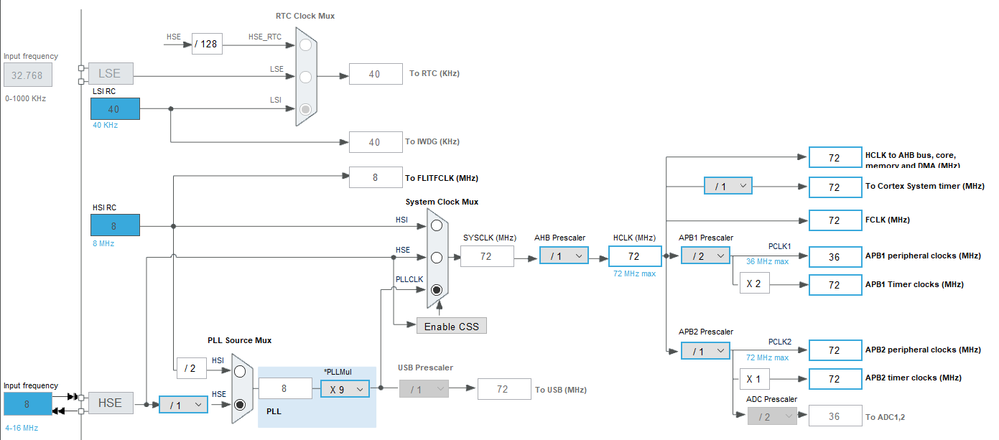
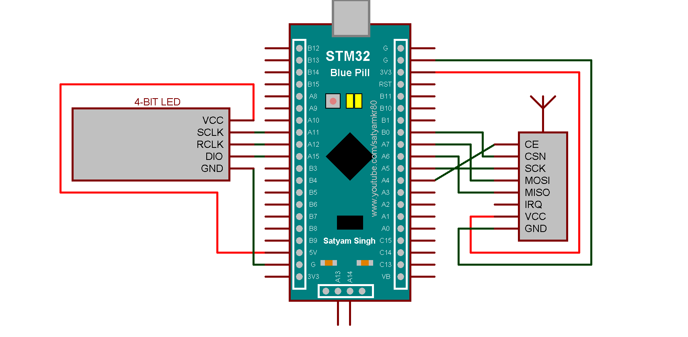
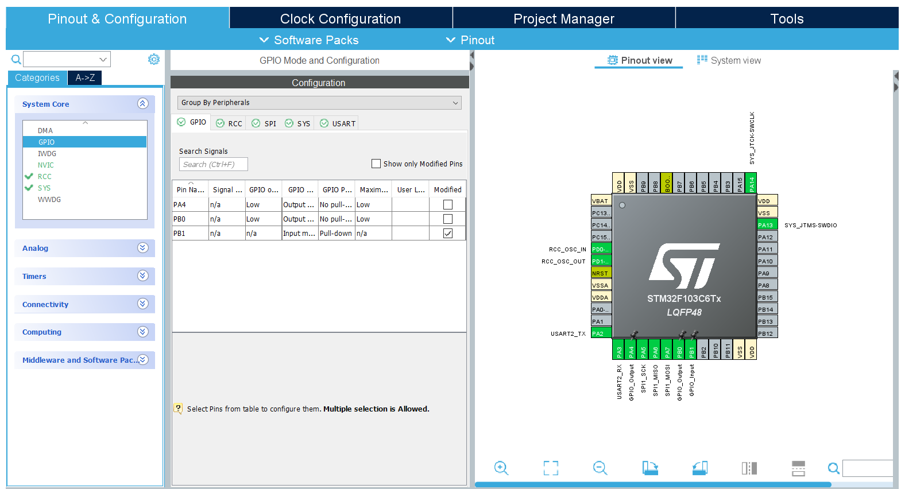
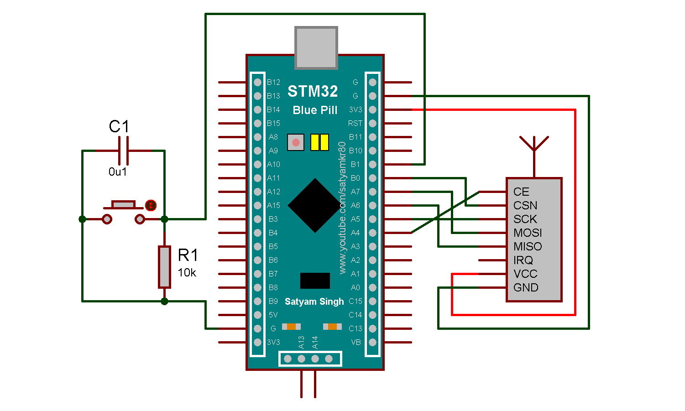

[English](REAMDE.md) | **[Українська](README_UA.md)**

# Проект лічильника одиниць за допомогою передачі через NRF24 на базі STM32

## Що потрібно мати для роботи

**Елементи**

* 2X BluePill

* 2X NRF24l01

* 4 цифровий 7 сегментний індикатор з 74HC595 нижнім регістром

* Переключатель SS-5GL

* Монолітний монтажний конденсатор `0.1uF`

* Резистор `10kOm`

* Макетна плата

**Програмна частина**

* ST-LINK V2 програматор для STM32

* STM32CubeIDE

* STM32CubeIDE

**Бібліотеки**

* [NRF24l01](https://github.com/controllerstech/NRF24L01)

* [4 цифровий 7 сегментний індикатор з 74HC595 нижнім регістром](https://github.com/Korzhak/STM32_7Segment_74HC595_Library)

## Як налаштований проект

**RX**

1. Налаштування проекту:
   - `SYS` (Debug->Serial Wire)

   - `RCC` (HSE->Crystal/Ceramic Resonator)

   - `SPI1` (Mode->Full-Duplex Master)

   - `USART2` (Mode->Asynchronous)

   - `FREERTOS` (Interface->CMSIS_V2)
   

   - `GPIO->`
   

   - `Clock Configuration->`
   

2. Під'єднання:

   - STM32BluePill до NRF24l01: `3.3V - VCC`, `GND - GND`, `PB0 - CSN`, `PA7 - MOSI`, `PA6 - MISO`, `PA5 - SCK`, `PA4 - CE`
   
   - STM32BluePill до LED: `5V - VCC`, `GND - GND`, `PA11 - SCLK`, `PA10 - RCLK`, `PA9 - DIO`  

   

3. Переходимо в ***NRF24L01.c*** і робимо заміну на свої значення, якщо потрібно

```cpp
#define NRF24_CE_PORT   GPIOA // Вказуємо свій порт
#define NRF24_CE_PIN    GPIO_PIN_4 // Вказуємо свій пін

#define NRF24_CSN_PORT   GPIOB // Вказуємо свій порт 
#define NRF24_CSN_PIN    GPIO_PIN_0 // Вказуємо свій пін
```

4. Переходимо в ***main.c*** і робимо заміну на свої значення, якщо потрібно

```cpp
/* USER CODE BEGIN 2 */
  NRF24_Init();

  NRF24_RxMode(RxAddress, 10);

  NRF24_ReadAll(data);
 //                 SCLK PIN   SCLK Port   RCLK PIN   RCLK Port   DIO PIN   DIO PORT
  setUp(&ledStruct, GPIO_PIN_11, GPIOA, GPIO_PIN_10, GPIOA, GPIO_PIN_9, GPIOA); // замінюємо на свої значення 

  /* USER CODE END 2 */
```

**TX**

1. Налаштування проекту:
   - `SYS` (Debug->Serial Wire)

   - `RCC` (HSE->Crystal/Ceramic Resonator)

   - `SPI1` (Mode->Full-Duplex Master)

   - `USART2` (Mode->Asynchronous)

   - `FREERTOS` (Interface->CMSIS_V2)

   - `GPIO->`
   

   - `Clock Configuration->`
   

2. Під'єднання:

   - STM32BluePill до NRF24l01: `3.3V - VCC`, `GND - GND`, `PB0 - CSN`, `PA7 - MOSI`, `PA6 - MISO`, `PA5 - SCK`, `PA4 - CE`
   
   - STM32BluePill до Макетної плати і SS-5GL: `3.3V - +`, `GND - -`, `PB1 - Макетна плата` 

   

3. Переходимо в ***NRF24L01.c*** і робимо заміну на свої значення, якщо потрібно

```cpp
#define NRF24_CE_PORT   GPIOA // Вказуємо свій порт
#define NRF24_CE_PIN    GPIO_PIN_4 // Вказуємо свій пін

#define NRF24_CSN_PORT   GPIOB // Вказуємо свій порт 
#define NRF24_CSN_PIN    GPIO_PIN_0 // Вказуємо свій пін
```
